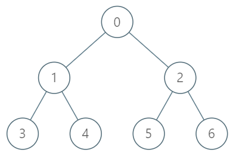

## 1483. 树节点的第 K 个祖先

给你一棵树，树上有 n 个节点，按从 0 到 n-1 编号。树以父节点数组的形式给出，其中 parent[i] 是节点 i 的父节点。树的根节点是编号为 0 的节点。  

树节点的第 k 个祖先节点是从该节点到根节点路径上的第 k 个节点。  

实现 TreeAncestor 类：  

- TreeAncestor（int n， int[] parent） 对树和父数组中的节点数初始化对象。  
- getKthAncestor(int node, int k) 返回节点 node 的第 k 个祖先节点。如果不存在这样的祖先节点，返回 -1 。  


示例 1：




输入：
>["TreeAncestor","getKthAncestor","getKthAncestor","getKthAncestor"]  
>[[7,[-1,0,0,1,1,2,2]],[3,1],[5,2],[6,3]]  

输出：  
>[null,1,0,-1]  

解释：
TreeAncestor treeAncestor = new TreeAncestor(7, [-1, 0, 0, 1, 1, 2, 2]);  

treeAncestor.getKthAncestor(3, 1);  // 返回 1 ，它是 3 的父节点  
treeAncestor.getKthAncestor(5, 2);  // 返回 0 ，它是 5 的祖父节点  
treeAncestor.getKthAncestor(6, 3);  // 返回 -1 因为不存在满足要求的祖先节点  
 

提示：

- $1 <= k <= n <= 5 * 10^4$
- parent[0] == -1 表示编号为 0 的节点是根节点。
- 对于所有的 0 < i < n ，0 <= parent[i] < n 总成立
- 0 <= node < n
- 至多查询 $5 * 10^4$ 次

## 题解

### 解法一、树上倍增

令pa[x][i]表示节点x的第$2^i$个祖先节点，则pa[x][i + 1] = pa[pa[x][i]][i]；规定当pa[x][i] = -1时，pa[x][i + 1] = -1, pa[x][0]表示父节点。

```java
class TreeAncestor {
    private int[][] parents;

    static int index(int val, int start) {
        while ((val & (1<<start)) == 0) start++;
        return start;
    }

    public TreeAncestor(int n, int[] parent) {
        int h = (int)(Math.log(n)/Math.log(2)) + 1;
        parents = new int[n][h];
        for (int x = 0; x < n; x++) parents[x][0] = parent[x];
        for (int i = 0; i < h - 1; i++) {
            for (int x = 0; x < n; x++) {
                int p = parents[x][i];
                parents[x][i + 1] = p != -1? parents[p][i]: -1;
            }
        }
    }
    
    public int getKthAncestor(int node, int k) {
        int idx = 0;
        while (k > 0) {
            idx = index(k & -k, idx);
            node = parents[node][idx];
            if (node == -1) return -1;
            k &= k - 1;
        }
        return node;
    }
}
```