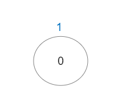

## 2421. 好路径的数目

给你一棵 n 个节点的树（连通无向无环的图），节点编号从 0 到 n - 1 且恰好有 n - 1 条边。

给你一个长度为 n 下标从 0 开始的整数数组 vals ，分别表示每个节点的值。同时给你一个二维整数数组 edges ，其中 edges[i] = [ai, bi] 表示节点 ai 和 bi 之间有一条 无向 边。

一条 好路径 需要满足以下条件：

- 开始节点和结束节点的值 相同 。
- 开始节点和结束节点中间的所有节点值都 小于等于 开始节点的值（也就是说开始节点的值应该是路径上所有节点的最大值）。
请你返回不同好路径的数目。

注意，一条路径和它反向的路径算作 同一 路径。比方说， 0 -> 1 与 1 -> 0 视为同一条路径。单个节点也视为一条合法路径。

 

示例 1：


>输入：vals = [1,3,2,1,3], edges = \[[0,1],[0,2],[2,3],[2,4]]  
>输出：6  
>解释：总共有 5 条单个节点的好路径。  
>还有 1 条好路径：1 -> 0 -> 2 -> 4 。  
>（反方向的路径 4 -> 2 -> 0 -> 1 视为跟 1 -> 0 -> 2 -> 4 一样的路径）  
>注意 0 -> 2 -> 3 不是一条好路径，因为 vals[2] > vals[0] 。  


示例 2：


>输入：vals = [1,1,2,2,3], edges = \[[0,1],[1,2],[2,3],[2,4]]  
>输出：7  
>解释：总共有 5 条单个节点的好路径。  
>还有 2 条好路径：0 -> 1 和 2 -> 3 。  


示例 3：



>输入：vals = [1], edges = []  
>输出：1  
>解释：这棵树只有一个节点，所以只有一条好路径。  
 

提示：

- n == vals.length
- 1 <= n <= 3 * $10^4$
- 0 <= vals[i] <= $10^5$
- edges.length == n - 1
- edges[i].length == 2
- 0 <= ai, bi < n
- ai != bi
- edges 表示一棵合法的树。


## 题解

### 解法一、穷举法（超时）

```java
class Solution {

    // 以root为根节点，根到叶子节点值都不大于val且值为val的节点数目
    // 对应一个长度为一的路径，和多个长度不为一有向路径
    int traversal(List<Integer>[] g, int[] vals, int root, int pre, int val) {
        if (vals[root] > val) return 0;
        int cnt = vals[root] == val? 1: 0;
        for (int child: g[root]) {
            if (child == pre) continue;
            cnt += traversal(g, vals, child, root, val);
        }
        return cnt;
    }

    public int numberOfGoodPaths(int[] vals, int[][] edges) {
        int n = vals.length;
        List<Integer>[] g = new List[n];
        for (int i = 0; i < n; i++) g[i] = new ArrayList<Integer>();
        for (int[] edge: edges) {
            int x = edge[0], y = edge[1];
            g[x].add(y);
            g[y].add(x);
        }

        int numOfPath = 0;
        for (int i = 0; i < n; i++) {
            numOfPath += traversal(g, vals, i, -1, vals[i]);
        }
        return (numOfPath - n) / 2 + n;
    }
}
```

### 解法二、并查集

```java

```