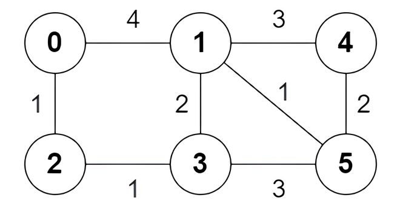

## 3123. 最短路径中的边

给你一个 n 个节点的无向带权图，节点编号为 0 到 n - 1 。图中总共有 m 条边，用二维数组 edges 表示，其中 edges[i] = [ai, bi, wi] 表示节点 ai 和 bi 之间有一条边权为 wi 的边。

对于节点 0 为出发点，节点 n - 1 为结束点的所有最短路，你需要返回一个长度为 m 的 boolean 数组 answer ，如果 edges[i] 至少 在其中一条最短路上，那么 answer[i] 为 true ，否则 answer[i] 为 false 。

请你返回数组 answer 。

注意，图可能不连通。

示例 1：



>输入：n = 6, edges = \[[0,1,4],[0,2,1],[1,3,2],[1,4,3],[1,5,1],[2,3,1],[3,5,3],[4,5,2]]  
>  
>输出：[true,true,true,false,true,true,true,false]  
>  
>解释：  
>  
>以下为节点 0 出发到达节点 5 的 所有 最短路：  
>  
>路径 0 -> 1 -> 5 ：边权和为 4 + 1 = 5 。  
>路径 0 -> 2 -> 3 -> 5 ：边权和为 1 + 1 + 3 = 5 。  
>路径 0 -> 2 -> 3 -> 1 -> 5 ：边权和为 1 + 1 + 2 + 1 = 5 。  


示例 2：


>输入：n = 4, edges = \[[2,0,1],[0,1,1],[0,3,4],[3,2,2]]  
>  
>输出：[true,false,false,true]  
>  
>解释：  
>  
>只有一条从节点 0 出发到达节点 3 的最短路 0 -> 2 -> 3 ，边权和为 1 + 2 = 3 。  

 

提示：

- 2 <= n <= 5 * $10^4$
- m == edges.length
- 1 <= m <= min(5 * $10^4$, n * (n - 1) / 2)
- 0 <= ai, bi < n
- ai != bi
- 1 <= wi <= $10^5$
- 图中没有重边。

## 题解

### 解法一、dijkstra算法

```java
class Solution {
    // 计算节点到其它点的最短路，返回值不包含对应的前驱节点
    // 当某个节点不可达时，对应的dist值为Inf
    int[] dijkstra(List<int[]>[] g, int init) {
        int n = g.length;
        int[] dist = new int[n];
        Arrays.fill(dist, Integer.MAX_VALUE);
        dist[init] = 0;
        // (d, node, preNode): 前驱节点为preNode时到达节点node的最短距离
        Queue<int[]> queue = new PriorityQueue<>((a, b) -> a[0] > b[0]? 1: -1);
        queue.offer(new int[]{0, init, -1});

        while (!queue.isEmpty()) {
            int[] item = queue.poll();
            int d = item[0], u = item[1], pu = item[2];
            if (dist[u] != d) continue;
            for (int[] edge: g[u]) {
                int v = edge[0], w = edge[1];
                if (v == pu) continue;
                if (d + w < dist[v]) {
                    dist[v] = d + w;
                    queue.offer(new int[]{d + w, v, u});
                }
            }
        }

        return dist;
    }

    // 从节点0到节点u，再从u到v，最后到n - 1的最短路径，或者
    // 从节点0到节点v, 再从v到u，最后到n - 1的最短路径中的较小者等于最短路，则边(u, v)在最短路上
    // 注意有的节点不可达
    public boolean[] findAnswer(int n, int[][] edges) {
        List<int[]>[] g = new List[n];
        for (int i = 0; i < n; i++) g[i] = new ArrayList<int[]>();
        for (int[] edge: edges) {
            int u = edge[0], v = edge[1], w = edge[2];
            g[u].add(new int[]{v, w});
            g[v].add(new int[]{u, w});
        }

        boolean[] ans = new boolean[edges.length];
        int[] dist0 = dijkstra(g, 0);
        if (Integer.MAX_VALUE == dist0[n - 1]) {
            return ans;
        }
        int d = dist0[n - 1];
        int[] dist1 = dijkstra(g, n - 1);
        for (int i = 0; i < edges.length; i++) {
            int u = edges[i][0], v = edges[i][1], w = edges[i][2];
            if (dist0[u] != Integer.MAX_VALUE && dist1[v] != Integer.MAX_VALUE) {
                ans[i] = dist0[u] + w + dist1[v] == d;
            }
            if (dist0[v] != Integer.MAX_VALUE && dist1[u] != Integer.MAX_VALUE) {
                ans[i] = ans[i] || dist0[v] + w + dist1[u] == d;
            }
        }
        return ans;
    }
}
```

