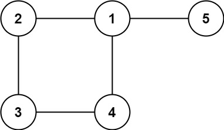

## 684. 冗余连接

树可以看成是一个连通且 无环 的 无向 图。

给定往一棵 n 个节点 (节点值 1～n) 的树中添加一条边后的图。添加的边的两个顶点包含在 1 到 n 中间，且这条附加的边不属于树中已存在的边。图的信息记录于长度为 n 的二维数组 edges ，edges[i] = [ai, bi] 表示图中在 ai 和 bi 之间存在一条边。

请找出一条可以删去的边，删除后可使得剩余部分是一个有着 n 个节点的树。如果有多个答案，则返回数组 edges 中最后出现的那个。

示例 1：


>输入: edges = \[[1,2], [1,3], [2,3]]  
>输出: \[2,3]  


示例 2：



>输入: edges = \[[1,2], [2,3], [3,4], [1,4], [1,5]]  
>输出: \[1,4]  
 

提示:

- n == edges.length
- 3 <= n <= 1000
- edges[i].length == 2
- 1 <= ai < bi <= edges.length
- ai != bi
- edges 中无重复元素
- 给定的图是连通的 

## 题解

### 解法一、并查集

```java
class Solution {

    private int[] fa;

    void init(int n) {
        fa = new int[n + 1];
        Arrays.fill(fa, -1);
    }

    int find(int x) {
        return fa[x] < 0? x: (fa[x] = find(fa[x])); 
    }

    void union(int x, int y) {
        // 按大小合并
        int fx = find(x);
        int fy = find(y);
        if (fa[fx] > fa[fy]) {
            fa[fy] += fa[fx];
            fa[fx] = fy;
        } else {
            fa[fx] += fa[fy];
            fa[fy] = fx;
        }
    }


    // 查找边的两个节点对应的等价类根节点
    // 若根节点不同则合并等价类，否则返回这条边
    public int[] findRedundantConnection(int[][] edges) {
        init(edges.length);
        for (int[] edge: edges) {
            int u = edge[0], v = edge[1];
            int fu = find(u);
            int fv = find(v);
            if (fu == fv) return edge;
            union(u, v);
        }
        return new int[0];
    }
}
```