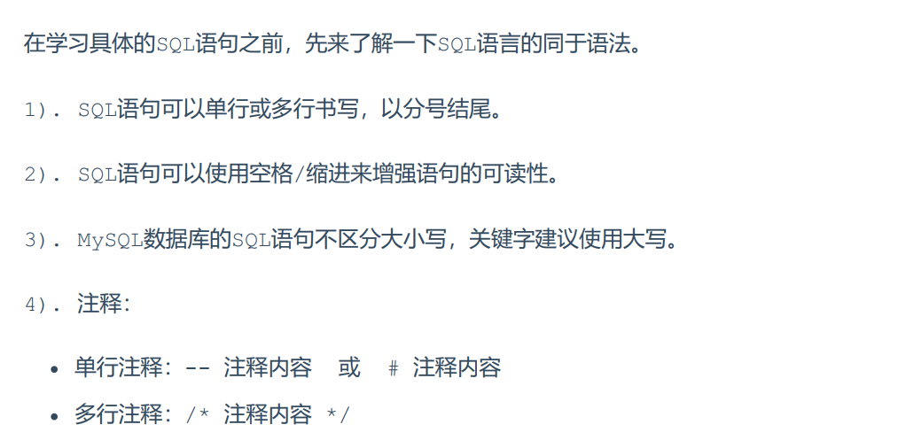
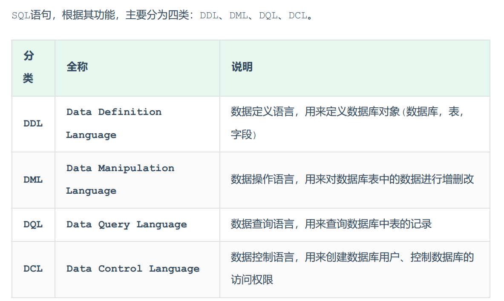

## MySQL笔记

1. SQL语法
   

2. SQL语句分类
   

3. 数据库DDL语句

```sql
# 查询所有数据库
show databases;

# 查询当前使用数据库
select databases();

# 创建数据库
create database [if not exists] database_name;

# 使用数据库
use database_name;

# 删除数据库
drop [if exists] database_name;
```

4. 数据表DDL语句

```sql
# 数据表DDL必须指定数据库

# 查询当前数据库所有表
show tables;

# 描述表定义信息
desc table_name;

# 详细描述表定义信息
show create table table_name;

# 创建数据表
create table table_name (
    name1 type1 [comment anotation1],
    name2 type2 [comment anotation2],
    name3 type3 [comment anotation3],
    ...
    namen typen [comment anotationn]
)[comment anotation];

# 删除数据表
drop table [if exists] table_name;

# 删除数据表保留表名
truncate table table_name;
```

5. 数据表修改语句

6. 1
7. 1
8. 1
9.  1
10. 1
11. 1
12. 1
13. 1
14. 1
15. 1
16. 1
17. 1
18. 1
19. 1
20. 11
21. 1
22. 1
23. 1
24. 1
25. 1